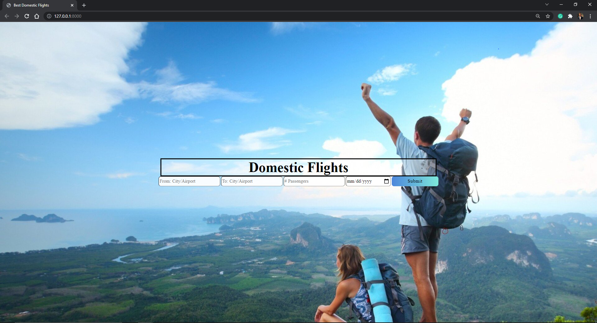
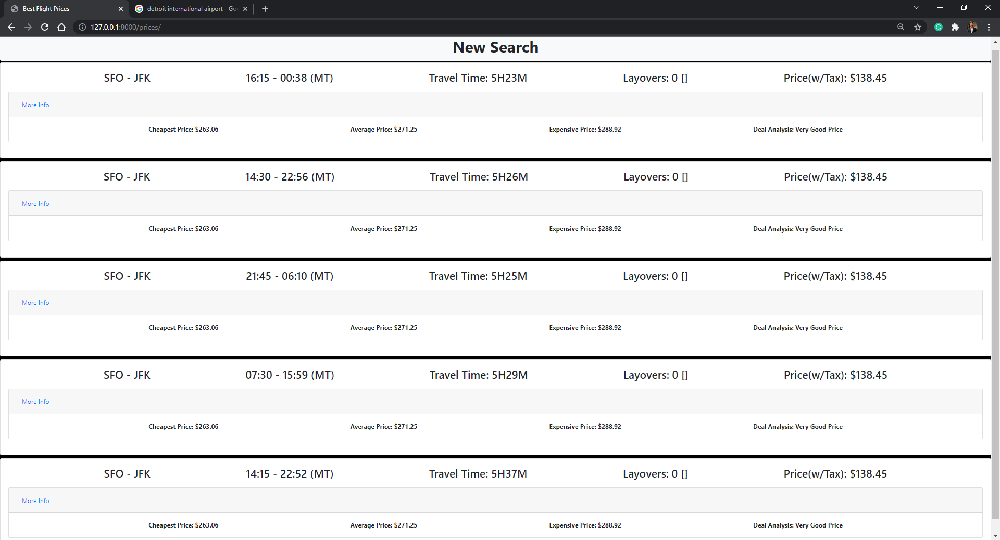
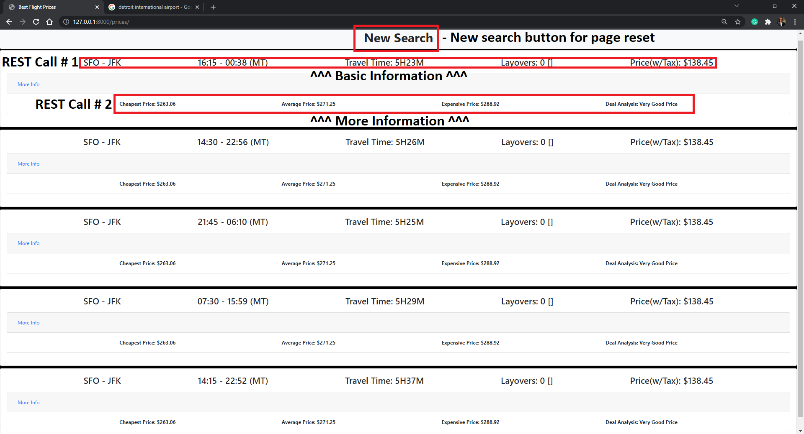

# onlyFlights

Basic web application that produces the cheapest one way flight search results for domestic airlines. This web app will also work with international, but with a limited data set. Also does analysis on the respective flight price to determine if it is a good deal relative to other flights. 

## Frameworks & Tools: 
- Django (Handles Server/Backend)
- Python (Handles Logic + API Calls) 
- Amadeus API (API for Flights)
- HTML/CSS/Bootstrap (Front End) 
## Start Up
```
#Run from project root
.\venv\Scripts\activate
cd mySite\
python .\manage.py runserver
```
## Demo





